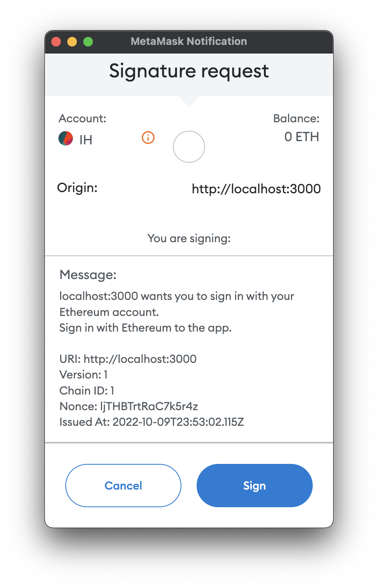

# next-siwe

Sign in with Ethereum for Next.js. Read more on SIWE: [https://github.com/spruceid/siwe](https://github.com/spruceid/siwe)



## Getting Started

Install next-siwe and dependencies:

```
npm i next-siwe wagmi ethers
```

Create the SIWE endpoint at ./pages/api/siwe/[siwe].ts

```
import { nextSIWE } from "next-siwe"

export default nextSIWE({
  secret: process.env.JWT_SECRET
})
```

Configure the provider inside of WagmiConfig:

```
function App({ Component, pageProps }) {
  return (
    <WagmiConfig client={client}>
      <SIWEProvider>
        <Component {...pageProps} />
      </SIWEProvider>
    </WagmiConfig>
  )
}
```

Use it in your pages/components:

```
import { useAccount, useConnect } from 'wagmi'
import { useSIWE } from "next-siwe"

const Auth = () => {
  const { connector: activeConnector, isConnected } = useAccount()
  const { connect } = useConnect()
  const { isAuthenticated, login, logout } = useSIWE()

  if (!isConnected) {
    return <button onClick={connect}>Connect Wallet</button>
  }

  if (!isAuthenticated) {
    return <button onClick={login}>Sign in with Ethereum</button>
  }

  return (
    <span>
      Connected to {activeConnector.name} <button onClick={logout}>Disconnect</button>
    </span>
  )
}
```

... and you're good to go 🎉
